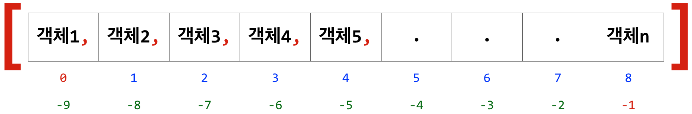
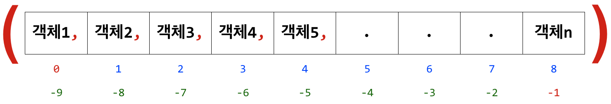
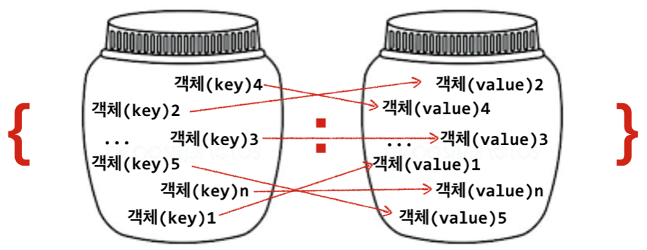

6장: 복합자료형
===

Compound Data Types

***
**박 진 수** 교수    
Intelligent Data Semantics Lab  
Seoul National University
***


# 리스트(`list`)

**가변자료형**(mutable)이다.
- 생성한 후 내용의 변경이 가능하다. 즉, 담고 있는 객체를 삭제, 변경, 삽입하는 것이 가능하다.

**순서를 가지는** 0개 이상의 객체를 참조하는 **시퀀스형**이다.
- 각 객체는 쉼표(,)로 구분한다.

리스트 자신을 포함해 어떠한 자료형도 담을 수 있다.

유연성 높아 파이썬에서 가장 흔히 사용되는 자료형이다.

출력 형식
- 리스트는 항상 `[ ]`(대괄호) 형태로 출력한다.



<!--

-->

## 리스트 생성

리스트를 만드는 방법으로는 다음 세 가지가 있다.

- `[ ]`(대괄호)

- `list()` 생성자(클래스)

- 리스트 축약(list comprehension)
    - <바로 쓰는 파이썬: 기초 편>의 [부록 5 - 리스트/딕셔너리/세트 축약](https://github.com/snu-python/pythonbook/blob/master/Appendix5%20List%20Dictionary%20Set%20Comprehension.pdf) 참조
    - <https://github.com/snu-python/pythonbook>

### 따라해보기

대괄호 `[ ]`를 사용해서 리스트를 만들어보자.
- 각 객체는 쉼표(,)로 구분한다.

```python
number_list = [1, 0, -5, -1.23, 27]
```

```python
print(number_list)
```

`list()` 생성자를 사용해서 리스트를 만들어 보자.
- `list()`의 전달인자로 **순회형**만 올 수 있다. 
- 순회형(iterable)이란 담고 있는 객체들에 하나씩 순서대로 접근할 수 있는 자료형으로 문자열, 리스트, 튜플, 딕셔너리, 세트가 있다. 

```python
string_list= list('가나다라마바사')
```

```python
print(string_list)
```

모든 복합자료형은 어떠한 자료형도 담을 수 있다.
- 따라서 리스트는 리스트 자신을 포함해 어떠한 자료형도 담을 수 있다.

```python
complex_list = [list(), number_list, ['x', 3, string_list], True, None]
```

```python
print(complex_list)
```

앞서 만든 리스트의 길이, 즉 각 리스트가 담고 있는 객체의 개수를 확인해보자.
- `len()` 함수는 순회형(`str`, `list`, `tuple`, `dict`, `set`) 객체의 길이(담고 있는 객체의 수)를 반환한다.

```python
# [1, 0, -5, -1.23, 27]
len(number_list)
```

```python
# list('가나다라마바사')
len(string_list)
```

```python
# [list(), number_list, ['x', 3, string_list], True, None]
len(complex_list)
```

문자열은 불변자료형이라 생성한 후 내용의 변경이 불가능하다.

```python
s = 'abcde'
s[0] = 'A'  # a를 A로 바꾼다.
```

리스트는 가변자료형이라 생성한 후 내용의 변경이 가능하다.

```python
L = ['a', 'b', 'c', 'd', 'e']
L[0] = 'A'  # 'a'를 'A'로 바꾼다.
```

```python
print(L)
```

## 리스트 인덱스

문자열 인덱스와 같은 원리로 작동한다.

### 따라해보기

```python
band = ['보컬', ['기타1', '기타2', '베이스'], '드럼', '키보드']
```

```python
band[0]           # 첫 번째 객체를 추출한다.
```

```python
# ['보컬', ['기타1', '기타2', '베이스'], '드럼', '키보드']
band[-1]          # 마지막 객체를 추출한다.
```

```python
# ['보컬', ['기타1', '기타2', '베이스'], '드럼', '키보드']
band[1]           # 두 번째 객체를 추출한다. 
```

```python
# ['보컬', ['기타1', '기타2', '베이스'], '드럼', '키보드']
band[1][1]        # 두 번째 객체의 두 번째 객체를 추출한다.
```

```python
# ['보컬', ['기타1', '기타2', '베이스'], '드럼', '키보드']
band[1][-1][0]    # 두 번째 객체의 마지막 객체(문자열)의 첫 번째 문자를 추출한다.
```

리스트 범위 밖의 객체를 지정해서는 안 된다.

```python
# ['보컬', ['기타1', '기타2', '베이스'], '드럼', '키보드']
band[99]
```

기존 객체를 새로운 객체로 바꿀 수도 있는데 교체하고자 하는 자리의 인덱스 번호를 지정한 후 새로운 객체를 할당하면 된다. 

교체하는 형식은 다음과 같다.

**`리스트[인덱스번호] = 새로운-객체`**

```python
# ['보컬', ['기타1', '기타2', '베이스'], '드럼', '키보드']
band[2] = '카혼'   # 리스트의 세 번째 객체를 교체한다. 
```

```python
print(band)
```

리스트 안의 리스트에 있는 객체도 바꿀 수 있다.

```python
# ['보컬', ['기타1', '기타2', '베이스'], '카혼', '키보드']
band[1][0] = '통기타' # 리스트 두 번째 객체의 첫 객체를 교체한다.
```

```python
print(band)
```

## 리스트 관련 연산자

리스트와 관련된 연산자로는 다음과 같은 것이 있다.

`+` : 결합 연산자  
`*` : 반복 결합 연산자   
`+=` : 확장 연산자  

`[:]` : 분할 연산자  
`del` : 삭제 연산자   
`in`/`not in` : 멤버십 연산자

**결합 연산자**

```python
[1, 2, 3] + [4, 5, 6]
```

```python
['a', 'b'] + ['c', 'd']
```

**반복 연산자**

```python
[0] * 5
```

```python
[1, 2, 3] * 3
```

**확장 연산자**

우변의 객체를 병합해서 좌변의 리스트를 확장한다.
- `+=`의 우변에는 순회형이 와야 한다.
- `extend(순회형)` 메소드도 같은 기능을 수행한다.

**따라해보기**

```python
list1 = ['프로도', '네오']
list2 = ['라이언', '콘']
list1 += list2
```

```python
print(list1)
```

```python
# ['프로도', '네오', '라이언', '콘']
list1 += 307
```

***왜 오류가 나는 것일까?***

***어떻게 하면 307을 리스트에 넣을 수 있을까?***

```python
list1 += [307]
```

```python
print(list1)
```

```python
# ['프로도', '네오', '라이언', '콘', 307]
list1 += '제이지'
```

```python
print(list1)
```

***어떻게 된 일인가?***

```python
# ['프로도', '네오', '라이언', '콘', 307, '제', '이', '지']
list1[-3:] = []  # 마지막 3개를 삭제한다.
```

```python
# ['프로도', '네오', '라이언', '콘', 307]
list1 += ['제이지']
```

```python
print(list1)
```

**분할 연산자**

분할 연산자 `[ : ]`와 `[ : : ]`는 리스트 분할을 통해 리스트의 객체를 추출한다. 
- 앞서 배운 문자열 분할 연산자와 같은 기능을 한다.

**삭제 연산자**

`del`은 객체의 참조를 삭제하는 연산자다. 
- 따라서 리스트 객체뿐만 아니라 파이썬에서 사용하는 모든 자료형에서 객체 참조를 삭제하는 데 사용할 수 있다. 

형식은 다음과 같다.

`del` ***객체***

**따라해보기**

```python
L = ['a', 'b', 'c', 'd', ['x', 'y', 'z'], 'e', 'f']
```

```python
# 다섯 번째 객체의 마지막 객체를 삭제한다.
del L[4][-1]
```

```python
print(L)
```

```python
# --- ['a', 'b', 'c', 'd', ['x', 'y'], 'e', 'f']
# 다섯 번째 객체를 삭제한다.
del L[4]
```

```python
print(L)
```

```python
# --- ['a', 'b', 'c', 'd', 'e', 'f']
# 두 번째와 세 번쩨 객체를 삭제한다.
del L[1:3]
```

```python
print(L)
```

```python
# --- ['a', 'd', 'e', 'f']
# 리스트의 모든 객체를 삭제한다.
del L[:]
```

```python
print(L)
```

**멤버십 연산자**

멤버십 연산은 순회형 값 안에 객체가 존재하는지 여부를 '참(`True`)' 또는 '거짓(`False`)'으로 알려준다.

형식은 다음과 같다.

***객체*** `in` ***순회형***

***객체*** `not in` ***순회형***

**따라해보기**

```python
L = ['a', 'b', ['c', 'd', 'e']]
```

```python
'a' in L
```

```python
# ['a', 'b', ['c', 'd', 'e']]
'c' in L
```

***왜 그럴까?***

```python
# ['a', 'b', ['c', 'd', 'e']]
'c' in L[-1]
```

```python
# ['a', 'b', ['c', 'd', 'e']]
'b' not in L
```

```python
# ['a', 'b', ['c', 'd', 'e']]
'f' not in L
```

참고로 멤버십 연산자는 모든 ***순회형***에 적용할 수 있기 때문에 문자열에 일부 문자가 포함되어 있는지 확인할 때도 사용할 수 있다. 

```python
text = 'Don’t just play on your phone, program it'
```

```python
'j' in text
```

```python
# 'Don’t just play on your phone, program it'
'd' in text
```

```python
# 'Don’t just play on your phone, program it'
'program' in text
```

## 리스트 관련 메소드

추가 메소드 : `append()`, `extend()`, `insert()`   
삭제 메소드 : `pop()`, `remove()`  
질의 메소드 : `count()`, `index()`   
정렬 메소드 : `reverse()`, `sort()`

### 따라해보기

**추가 메소드**

*L*.**append**(***x***)
- 리스트 *L*의 마지막에 객체 ***x***를 추가한다.


```python
L = []
L.append('a')
L.append('b')
```


```python
print(L)
```


```python
# ['a', 'b']
L.append(['d', 'e'])  # ['d', 'e']를 추가한다.
```


```python
print(L)
```

*L*.**extend**(***m***)
- 순회형 ***m***의 모든 객체를 리스트 *L*의 끝에 추가한다. 
- *L* **+=** ***m***과 같다.


```python
# ['a', 'b', ['d', 'e']]
L.extend(['f', 'g'])  # ['f', 'g']를 확장 추가한다.
```


```python
print(L)
```

*L*.**insert**(***i***, ***x***)
- 리스트 *L*의 인덱스 ***i***에 객체 ***x***를 삽입한다.


```python
# ['a', 'b', ['d', 'e'], 'f', 'g']
L.insert(4, 'b')
```


```python
print(L)
```

**삭제 메소드**

*L*.**pop()** / *L*.**pop**(***i***)

- *L*.**pop()** : 리스트 *L*의 가장 오른쪽에 있는 객체(마지막 객체)를 반환한 후 삭제한다. 

- *L*.**pop**(***i***) : 리스트 *L*의 인덱스 ***i***에 있는 객체를 반환한 후 삭제한다.

- 빈 리스트거나 설정한 인덱스 번호가 리스트 범위 밖이면 **IndexError**가 발생한다.


```python
# ['a', 'b', ['d', 'e'], 'f', 'b', 'g']
L.pop()
```


```python
print(L)
```


```python
# ['a', 'b', ['d', 'e'], 'f', 'b']
L.pop(2)
```


```python
print(L)
```


```python
# ['a', 'b', 'f', 'b']
L.pop(4)
```

*L*.**remove**(***x***)
- 리스트 *L*의 **가장 왼쪽**에 있는 객체(첫 번째 객체) ***x***를 삭제한다. 
- 객체 ***x***가 존재하지 않으면 **ValueError**가 발생한다.


```python
# ['a', 'b', 'f', 'b']
L.remove('b')
```


```python
print(L)
```


```python
# ['a', 'f', 'b']
L.remove('c')
```

**질의 메소드**

*L*.**count**(***x***)
- 리스트 *L*에서 객체 ***x***의 개수를 반환한다.


```python
L = ['a', 'b', ['c', 'd', 'e'], 'f', 'b', 'c', 'g']
```


```python
L.count('b')
```


```python
# ['a', 'b', ['c', 'd', 'e'], 'f', 'b', 'c', 'g']
L.count('c')
```

***왜 'c'가 한 개일까?***


```python
# ['a', 'b', ['c', 'd', 'e'], 'f', 'b', 'c', 'g']
L.count('e')
```


```python
L[2].count('e')
```

*L*.**index**(***x, 시작번호, 끝번호***)
- 리스트 *L*에 있는 객체 ***x*** 중 **가장 왼쪽**에 있는 객체 ***x***의 인덱스를 반환한다. 

- 리스트 *L*의 ***시작번호***와 ***끝번호*** 인덱스가 정해지면 인덱스 범위 안에 있는 객체 ***x*** 중 **가장 왼쪽**에 있는 객체 ***x***의 인덱스를 반환한다.
    - 분할 연산자처럼 ***시작번호***부터 ***끝번호*** **바로 앞**까지만 검색한다.

- 객체 ***x***가 없으면 **ValueError**가 발생한다.


```python
# ['a', 'b', ['c', 'd', 'e'], 'f', 'b', 'c', 'g']
L.index('b')
```


```python
# ['a', 'b', ['c', 'd', 'e'], 'f', 'b', 'c', 'g']
L.index('b', 3)  # 리스트의 네 번째부터 검색한다.
```


```python
# ['a', 'b', ['c', 'd', 'e'], 'f', 'b', 'c', 'g']
L.index('a', 3, 6)  # 리스트의 네 번째부터 여섯 번째 사이를 검색한다.
```

**정렬 메소드**

*L*.**reverse**()
- 리스트 *L*에 있는 객체들의 순서를 거꾸로 뒤집는다.


```python
# ['a', 'b', ['c', 'd', 'e'], 'f', 'b', 'c', 'g']
L.reverse()
```


```python
print(L)
```

*L*.**sort**(***key=None, reverse=False***) 
- 리스트 *L*을 정렬한다.
- 기본값으로 오름차순 정렬한다.


```python
# ['g', 'c', 'b', 'f', ['c', 'd', 'e'], 'b', 'a']
L.sort()
```

***왜 오류가 날까?***

정렬하는 모든 객체를 비교할 수 있어야 한다. 

만약 *L*이 담고 있는 객체 중 비교가 불가능한 객체가 있어 정렬을 할 수 없으면 **TypeError**가 발생한다.


```python
# --- ['g', 'c', 'b', 'f', ['c', 'd', 'e'], 'b', 'a']
# 정렬을 가능하게 하기 위해 다섯 번째 객체인 리스트를 삭제하여 문자열만 있도록 한다.
L.pop(4)  
```


```python
print(L)
```


```python
# ['b', 'c', 'f', 'g', 'b', 'a']
L.insert(2, 'M')
```


```python
print(L)
```


```python
# ['b', 'c', 'M', 'f', 'g', 'b', 'a']
L.sort()  # 오름차순으로 정렬한다.
```


```python
print(L)
```

***왜 대문자가 맨 앞에 있을까?***

Unicode에서 영어 대문자는 영어 소문자보다 앞 쪽에 위치하기 때문에 오름차순으로 정렬을 하면 대문자가 소문자보다 먼저 온다.

***그려면 대소문자 구분없이 정렬할 수는 없을까?***

`sort()` 메소드는 `sorted()` 함수처럼 키워드 전달인자 ***key***와 ***reverse***를 선택적으로 사용할 수 있다.

***key***의 전달인자로는 함수가 온다.
- 전달인자로 함수의 이름만 오고 함수 뒤에 오는 소괄호 `()`는 생략한다.
- 이 함수를 사용해서 원하는 방식으로 리스트 *L*을 정렬할 수 있다.


```python
# --- ['M', 'a', 'b', 'b', 'c', 'f', 'g']
# 대소문자 구분없이 정렬하기 위해 모든 문자열으로 소문자로 바꾼 후 정렬한다. 
L.sort(key=str.lower)  
```


```python
print(L)
```

***reverse***의 기본값은 '거짓(`False`)'이라 오름차순이 기본 정렬 방식이다.
- 하지만 전달인자를 '참(`True`)'으로하면 정렬이 내림차순으로 이루어진다.


```python
# --- ['a', 'b', 'b', 'c', 'f', 'g', 'M']
# reverse=True로 내림차순 정렬을 해서 소문자가 대문자보다 먼저 온다.
L.sort(reverse=True)
```


```python
print(L)
```


```python
# --- ['g', 'f', 'c', 'b', 'b', 'a', 'M']
# 대소문자 구분없이 내림차순으로 정렬한다.
L.sort(key=str.lower, reverse=True)
```


```python
print(L)
```

## 정렬 방법: `sort()` 메소드 vs. `sorted()` 함수

리스트의 `sort()` 매소드는 리스트 자체를 정렬한다. 

따라서, 원본 리스트를 정렬하지 않으려면, `sorted()` 함수를 사용해서 새로운 리스트 객체를 생성하는 것이 좋다.

### 따라해보기

```python
x = ['드럼', '기타', '키보드', '베이스']
```


```python
y = sorted(x) 
```


```python
# x = ['드럼', '기타', '키보드', '베이스']
print(y)
```


```python
print(x)  # x는 바뀌지 않는다.
```


```python
# x = ['드럼', '기타', '키보드', '베이스']
x.sort() 
```


```python
print(x)  # x 자체가 바뀐다.
```

기본적으로 `sort()` 메소드와 `sorted()` 함수는 값이 작은 것부터 큰 것으로, 즉 **오름차순**으로 담고 있는 객체를 정렬한다. 

만약 반대로 가장 값이 큰 것부터 작은 순, 즉 **내림차순**으로 정렬을 원하면, 매개변수 ***reverse***에 `True` 전달인자를 사용하면 된다. 

또한 기본 정렬 규칙으로 정렬하지 않고 다른 정렬 규칙으로 객체들을 정렬하고자 한다면 ***key*** 매개변수에 정렬 규칙을 구현한 함수(사용자 정의 함수 포함)를 전달인자로 사용하면 된다.
- 사용자 정의 함수는 주로 람다 함수를 많이 사용한다. 

다음 예는 절대값으로 반환된 결과를 내림차순으로 정렬한다. 


```python
L = [-5, 0, 9, 1, 3, -12]

# 절대 값을 기준으로 내림차순 정렬한다.
z = sorted(L, key=abs, reverse=True)
```


```python
print(z)
```

## Lab: 리스트 생성 및 수정

- 아래 항목(객체)을 포함하는 리스트를 생성한 후 출력한다.
    - **1, 7, [4, 9], 'f', ('a', 'b')**


- **'g'** 항목을 리스트의 마지막에 추가한 후 출력한다.

- 분할 연산자를 사용해서 리스트의 마지막 두 항목만 가지고 있는 리스트를 생성한 후 출력한다.

**실행 예**

<b><pre>> python list_demo.py
[1, 7, [4, 9], 'f', ('a', 'b')]
[1, 7, [4, 9], 'f', ('a', 'b'), 'g']
[('a', 'b'), 'g']</pre></b>

# 튜플(`tuple`)

**불변자료형**(immutable)이다.
- 생성한 후 내용의 변경이 불가능하다. 즉, 담고 있는 객체를 삭제, 변경, 삽입하는 것이 불가능하다.

- 순서가 있는 시퀀스형 자료의 객체를 변경할 필요가 있는 경우에는 처음부터 리스트를 사용하거나 `list()` 생성자를 사용하여 튜플을 리스트로 변환해야 한다.

순서를 가지는 0개 이상의 객체를 참조하는 **시퀀스형**이다.
- 각 객체는 쉼표(,)로 구분한다.

튜플 자신을 포함해 어떠한 자료형도 담을 수 있다.

출력 형식
- 튜플은 항상 `( )`(소괄호) 형태로 출력한다.



<!--

-->

하지만 튜플을 생성할 때는 소괄호 없이도 생성이 가능하다.

## 튜플 생성

튜플을 만드는 방법으로는 다음 세 가지가 있다.

- 소괄호 `( )` 안에 쉼표(,)로 구분한 객체

- 소괄호 없이 쉼표(,)로 구분한 객체

- `tuple()` 생성자(클래스)

### 따라해보기

소괄호 `( )`를 사용해서 튜플를 만들어보자.
- 각 객체는 쉼표(,)로 구분한다.


```python
t1 = (5, -3, 3.14, 'red', '드럼')
```


```python
print(t1)
```

소괄호 없이 튜플를 만들어보자.
- 각 객체는 쉼표(,)로 구분한다.


```python
t2 = 5, -3, 3.14, 'red', '드럼'
```


```python
print(t2)
```

앞서 만든 튜플의 자료형을 확인해보자.


```python
type(t1)
```


```python
type(t2)
```

`tuple()` 생성자를 사용해서 튜플을 만들어 보자.
- `tuple()`의 전달인자로 **순회형**만 올 수 있다. 
- 순회형(iterable)이란 담고 있는 객체들에 하나씩 순서대로 접근할 수 있는 자료형으로 문자열, 리스트, 튜플, 딕셔너리, 세트가 있다. 


```python
string_tuple= tuple('가나다라마바사')
```


```python
print(string_tuple)
```

모든 복합자료형은 어떠한 자료형도 담을 수 있다.
- 따라서 튜플은 튜플 자신을 포함해 어떠한 자료형도 담을 수 있다.


```python
complex_tuple = False, (), t2, ['x', 3, string_tuple], None
```


```python
print(complex_tuple)
```

앞서 만든 튜플의 길이, 즉 각 튜플이 담고 있는 객체의 개수를 확인해보자.


```python
# (5, -3, 3.14, 'red', '드럼')
len(t1)
```


```python
# 5, -3, 3.14, 'red', '드럼'
len(t2)
```


```python
# tuple('가나다라마바사')
len(string_tuple)
```


```python
# False, (), tuple2, ['x', 3, string_tuple], None
len(complex_tuple)
```

튜플은 불변자료형이라 생성한 후 내용의 변경이 불가능하다.


```python
# (5, -3, 3.14, 'red', '드럼')
t1[-1] = '기타'   # 수정 불가능
```

튜플은 리스트로 형변환이 가능하고 리스트도 튜플로 형변환이 가능하다.


```python
T = 1, 2, 3
```


```python
type(T)
```


```python
print(T)
```


```python
L = list(T)   # 튜플을 리스트로 형변환한다.
```


```python
type(L)
```


```python
print(L)
```


```python
T = tuple(L)  # 리스트를 튜플로 다시 형변환한다.
```


```python
type(T)
```


```python
print(T)
```

## 튜플 인덱스, 연산자, 메소드

튜플은 일단 생성하면 변경할 수 없기 때문에 튜플이 담은 객체에 영향을 미치지 않는 연산자와 메소드만 지원한다. 

따라서, 리스트 관련 연산자와 메소드 중 객체를 변경하는 연산자와 메소드를 제외한 나머지는 같다. 

## Lab: 튜플에서 분할 연산자와 멤버십 연산자 사용하기

- 아래 객체들을 포함하는 튜플을 생성해서 변수 ***t1***에 할당한다.
    - **1, 5, (2, 3), 'green', ['드럼', '기타']**
    

- 분할 연산자를 사용해서 ***t1***의 마지막 두 객체만 가지고 있는 튜플 ***t2***를 생성한다.

- **(2, 3)**이 ***t1***에 포함되어 있는지 확인한다.

- **5**가 ***t2***에 들어 있는지 확인한다.

**실행 예**

```code
> python tuple_demo.py
(1, 5, (2, 3), 'green', ['드럼', '기타'])
('green', ['드럼', '기타'])
True
False
```

## 튜플 할당

**`(x, y, z) = (i, j, k)`**

**`x, y, z = i, j, k`**

**튜플 할당(tuple assignment)이란?**

등호를 기준으로 우변의 값 혹은 표현식 각각을 좌변의 같은 위치에 해당하는 변수로 할당하는 것이다.
- 좌변 : 튜플 변수
- 우변 : 표현식 튜플(문자열과 리스트 같은 시퀀스형 자료도 가능)

**원리**
- 좌변의 변수에 대응하는 우변의 값을 할당한다.
- 우변의 모든 표현식은 좌변으로 할당하기 전에 평가(evaluation) 또는 계산을 해야 한다.
- 좌변의 변수 개수와 우변의 표현식 값의 개수는 반드시 일치해야 한다.

**이점**
- 튜플 할당은 매우 편리하고 유용하게 사용할 수 있다.
- 예를 들어, 한 줄에서 여러 개의 변수를 한꺼번에 할당하는 것이 가능해져 코드가 간소해진다.
- 두 변수 간의 값을 서로 바꿀 때(swap)에도 유용하다.


### 따라해보기

```python
i, j, k = '드럼', '기타', '피아노'
```


```python
print(i, j, k)
```


```python
# --- i, j, k = '드럼', '기타', '피아노'
# 스왑(swap operation)
i, j = j, i
```


```python
print(i, j, k)
```

***튜플 할당 기능이 없었다면?***


```python
# i, j, k = '드럼', '기타', '피아노' 대신 ...
i = '드럼'
j = '기타'
k = '피아노'
```


```python
# --- i, j, k = '드럼', '기타', '피아노'
# i, j = j, i 대신... 
tmp = j
j = i
i = tmp
print(i, j, k)
```


```python
a, b, c = ['엄마', '아빠', ('나', '동생')]
```


```python
print(a)
print(b)
print(c)
```


```python
email = 'abc@xyz.kr'
user_name, domain = email.split('@')
```


```python
print(user_name)
print(domain)
```


```python
x, y = 1, 2, 3
```

좌변의 변수 개수와 우변의 객체 개수가 같지 않으면 오류가 발생한다.

이런 경우 우변의 불필요한 객체 값을 좌변에서 더미 변수(dummy variable)인 밑줄(`_`)로 받아 처리하면 된다.


```python
# 2와 4가 불필요한 경우
x, _, y, _ = 1, 2, 3, 4
```


```python
print(x, y)
```

**[주의]**  
파이썬 셀에서 1개의 밑줄(`_`)은 가장 최근에 반환되었던 결과 값을 담고 있기 때문에 우변에 사용하면 예상치 못한 결과를 가져 올 수 있으니 주의해야 한다.


```python
# x, _, y, _ = 1, 2, 3, 4
print(_)
```

따라서, 다음과 같이 사용하면 예상치 못할 결과가 나올 수 있으니 주의해야 한다.


```python
x, y, z = 'a', _, _
print(x, y, z)
```

## 튜플 패킹과 언패킹

**튜플 패킹**(tuple packing)이란?

- 우변의 객체들을 좌변에 있는 변수 하나에 할당하는 것이다.

이는 마치 박스 하나에 여러 개의 물건을 집어넣는 것과 같다. 

다음과 같은 형식으로 사용한다.

**`t = (x, y, z)`**

**`t = x, y, z`**


```python
t = 3.14, [5, -3], 'green', ('드럼', '기타')  # 튜플 패킹
```


```python
type(t)   # t의 자료형은 튜플이다. 
print(t)
```

다음 코드를 보면 알 수 있듯이, 튜플을 생성할 때 우리가 이미 했던 일이다.


```python
t1 = (5, -3, 3.14, 'red', '드럼')
t2 = 5, -3, 3.14, 'red', '드럼'
```


```python
print(t1)
print(t2)
```

**튜플 언패킹**(tuple unpacking)이란?

- 우변의 패킹한 튜플 변수에서 여러 개의 값을 좌변으로 꺼내오는 것이다. 

- 즉, 튜플 안의 객체들을 여러 개의 변수에 한 번에 할당하는 것이라 할 수 있다. 

이는 마치 박스에 들어 있는 여러 개의 물건을 꺼내는 것과 같다. 

이때 좌변의 변수 개수와 우변의 튜플 길이가 같아야 한다.

다음과 같은 형식으로 사용한다. 

**`(x, y, z) = t`**

**`x, y, z = t`**


```python
# 튜플 패킹 : t = 3.14, [5, -3], 'green', ('드럼', '기타')
a, b, c, d = t  # 튜플 언패킹
```


```python
print(a)
```


```python
# 3.14, [5, -3], 'green', ('드럼', '기타')
print(b)
```


```python
# 3.14, [5, -3], 'green', ('드럼', '기타')
print(c)
```


```python
# 3.14, [5, -3], 'green', ('드럼', '기타')
print(d)
```

# 시퀀스형 패킹/언패킹 연산자 `*`

모든 시퀀스 자료형(리스트, 튜플 등)은 `*`를 사용하여 담고 있는 객체들을 패킹(packing) 또는 언패킹(unpacking) 할 수 있다.

여기에서는 시퀀스형 패킹만 살펴보고 `*`를 시퀀스형 언패킹 연산자로 사용하는 경우는 10장에서 다루기로 한다.

## 시퀀스형 패킹

좌변의 변수 중 어느 한 변수 앞에 `*` 부호를 붙여 다음과 같은 형식으로 사용한다.

**`x, ..., *y = i, j, k,...`**

다음과 같은 특징이 있다.

- 좌변의 변수는 반드시 두 개 이상이어야 한다. 

- `*y`는 좌변의 맨 앞이나 맨 뒤, 중간 어디에 와도 상관없다.

- 우변의 객체를 좌변의 변수에 할당할 때
    - 우변의 객체 개수가 좌변의 변수 개수보다 많으면
    - 우변의 객체를 좌변의 변수에 **순서대로 할당**한다. 

- 우변의 남은 객체는 모두 변수 `*y`에 리스트(`list`)로 할당한다.

- 남은 객체는 좌변의 `*y`의 위치에 따라 달라진다.

- 패킹한 `*y`의 자료형은 리스트(`list`)다.

## 따라해보기


```python
x, y, *z = 3.14, [5, -3], 'green', ('드럼', '기타')
```


```python
print(x)
```


```python
print(y)
```


```python
print(z)  # 리스트다.
```


```python
*x, y, z = 3.14, [5, -3], 'green', ('드럼', '기타')
```


```python
print(z)
```


```python
print(y)
```


```python
print(x)  # 리스트다.
```


```python
x, *y, z = 3.14, [5, -3], 'green', ('드럼', '기타')
```


```python
print(x)
```


```python
print(z)
```


```python
print(y)  # 리스트다.
```

# 딕셔너리(`dict`)

**가변자료형**(mutable)이다.

- 생성한 후 내용의 변경이 가능하다. 즉, 담고 있는 객체를 삭제, 변경, 삽입하는 것이 가능하다.

**순서없이**(unordered) 0개 이상의 키-매핑값(key-value) 쌍으로 된 객체를 참조하는 매핑형이다.

- 각 객체 쌍은 쉼표( , )로 구분한다.

- 객체 하나가 **키:매핑값** 형태로 되어 있으며, 키와 매핑값도 객체다.

- **키**(key) : 해시가능한 객체(불변자료형)만 가능하다.

- **매핑값**(value) : 어떠한 자료형의 객체도 가능하다.

출력 형식
- 딕셔너리는 항상 중괄호(**{ }**) 형태로 출력한다.



<!--

-->

**딕셔너리와 리스트의 차이**

- 리스트와 달리 **딕셔너리**가 담고 있는 객체는 순서가 없다.

- **리스트**는 같은 값을 가진 객체를 포함할 수 있지만, **딕셔너리**는 키의 중복을 허락하지 않기 때문에 같은 키를 가진 객체는 포함할 수 없다.
    - 단, 매핑값은 중복이 가능하다.
    - 즉, 키만 다르면 매핑값은 같아도 상관없다.

- 리스트와 달리 **딕셔너리**는 인덱스 개념이 없기 때문에 분할 연산자를 사용해 객체 전체 또는 일부를 추출할 수 없다.

- **리스트**는 인덱스 번호로 객체를 추출하지만, **딕셔너리**는 키로 객체를 추출한다.

## 딕셔너리 생성

딕셔너리를 만드는 방법으로는 다음 세 가지가 있다.

- `{ }`(중괄호)

- `dict()` 생성자(클래스)

- 딕셔너리 축약(dictionary comprehension)
    - <바로 쓰는 파이썬: 기초 편>의 [부록 5 - 리스트/딕셔너리/세트 축약](https://github.com/snu-python/pythonbook/blob/master/Appendix5%20List%20Dictionary%20Set%20Comprehension.pdf) 참조
    - <https://github.com/snu-python/pythonbook>

### 따라해보기

중괄호 `{ }`를 사용해서 딕셔너리를 만들어보자.
- 키:매핑값 쌍으로 된 각 객체는 쉼표(,)로 구분한다.


```python
family = {1: '엄마', 2: '아빠', 3: '동생'}
```


```python
print(family)
```

딕셔너리를 생성할 때 키와 매핑값을 할당해야 하는데 빈(null) 값도 허용한다.


```python
d1 = {None: None}
```


```python
type(d1)
len(d1)
```


```python
d2 = {None: '', '': None}
```


```python
type(d2)
len(d2)
```


```python
# {None: '', '': None}
print(d2[None])
print(d2[''])
```

모든 복합자료형은 어떠한 자료형도 담을 수 있다.
- 따라서 딕셔너리는 매핑값으로 딕셔너리 자신을 포함해 어떠한 자료형도 담을 수 있다.
- 단, 키는 해시가능한(hashable) 불변자료형(immutable)만 가능하다.


```python
mydict = {
    '악기': ['드럼', '기타', '베이스'],  # 매핑값이 리스트다.
    '가족': family,                  # 매핑값이 딕셔너리다.
    (10, 9): '한글날',               # 키가 튜플(불변자료형)이다.
    'RGB': [255, 72, 90],
    'id': (),                      # 매핑값이 빈 튜플이다.
    0: 55,
    -307: None,                    # 매핑값 뿐만 아니라 키에도 None이 올 수 있다
    'fruits': set()                # 매핑값이 세트다.
}
```


```python
print(mydict)
```

앞서 만든 각 딕셔너리가 담고 있는 객체의 개수를 확인해보자.


```python
# {1: '엄마', 2: '아빠', 3: '동생'}
len(family)
```


```python
# {'악기': ['드럼', '기타', '베이스'], 
#  '가족': {1: '엄마', 2: '아빠', 3: '동생'}, 
#  (10, 9): '한글날', 
#  'RGB': [255, 72, 90], 
#  'id': (), 
#  0: 55, 
#  -307: None, 
#  'fruits': set()}
len(mydict)
```

## 딕셔너리 인덱스

### 매핑값 추출하기

딕셔너리가 참조하는 객체들은 리스트와는 달리 순서가 없기 때문에 

- 인덱스 번호로 개별 객체를 추출할 수도 없고, 

- 분할 연산자를 사용해서 일부 또는 전체를 가져올 수도 없다. 

대신 다음 형식으로 키를 통해 매핑값을 추출할 수 있다.

**`딕셔너리[키]`**

**따라해보기**


```python
d3 = {None: 'Null value', True: '참', False: 0}
```


```python
# --- {None: 'Null value', True: '참', False: 0}
# None이 키다.

d3[None]
```


```python
# --- {None: 'Null value', True: '참', False: 0}
# False가 키다.

d3[False]        
```

앞에서 사용한 딕셔너리로 개별 객체를 추출하는 방법을 알아보자.


```python
# {'악기': ['드럼', '기타', '베이스'], ...}
mydict['악기']
```


```python
# {(10, 9): '한글날', ...}
mydict[(10, 9)]
```

### 키에 매핑값을 할당하기

이번에는 키에 매핑값을 할당해보자. 다음과 같은 형식으로 코드를 작성한다.

**`딕셔너리[키] = 매핑값`**

이 형식으로 

- 새로운 객체 쌍을 딕셔너리에 추가할 수도 있고, 

- 기존의 매핑값을 새로운 매핑값으로 갱신할 수도 있다.

**따라해보기**

**매핑값 갱신하기**

키가 이미 존재하는 경우에는 
- 기존의 매핑값을 새로운 매핑값으로 대체하게 된다.

이는 마치 리스트에서 인덱스를 사용해 인덱스 위치에 있는 객체를 새로운 객체로 **교체**하는 것과 비슷하다. 

그럼 ***family***의 키 3의 매핑값을 '동생'에서 '나'로 바꿔보자.


```python
# {1: '엄마', 2: '아빠', 3: '동생'}
family[3] = '나'
```


```python
print(family)
```

**객체 추가하기**

만약 키가 존재하지 않으면, 
- 새로운 객체를 키와 매핑값 쌍으로 딕셔너리에 추가한다.

이는 리스트에서 **append()** 메소드로 객체를 **추가**하는 것과 비슷하다. 

그럼 ***family***에 없는 키를 추가해보자.


```python
# --- {1: '엄마', 2: '아빠', 3: '나'}
# 키가 4이고 매핑값이 '동생'인 객체를 추가한다.

family[4] = '동생'
```


```python
print(family)
```

## 딕셔너리 관련 연산자

딕셔너리와 관련한 대표적인 연산자로는 다음과 같은 것이 있다.

- `del` : 삭제 연산자
- `in`/`not in` : 멤버십 연산자

### 삭제 연산자 

리스트에서 사용한 삭제 연산자 `del`은 딕셔너리에도 같은 원리로 사용할 수 있다. 

단지 차이점은 

- 리스트처럼 인덱스 번호나 분할 연산자를 사용하지 않고, 
- 키를 통해 대상 객체를 삭제한다는 점이다.

**따라해보기**


```python
print(mydict)
```


```python
# --- {'id': (), ...}
# 키가 'id'인 객체를 삭제한다.  

del mydict['id']  
```


```python
# --- {'악기': ['드럼', '기타', '베이스'], ...}
# 키가 '악기'인 객체의 매핑값(리스트) 중 마지막 객체를 삭제한다.

del mydict['악기'][-1]
```


```python
print(mydict)
```


```python
# --- {'가족': {1: '엄마', 2: '아버지', 3: '나', 4: '동생'}, ...}
# 키가 '가족'인 객체의 매핑값(딕셔너리) 중 키가 5인 객체를 삭제한다.

del mydict['가족'][4]  
```


```python
print(mydict)
```

### 멤버십 연산자

멤버십 연산자 `in`과 `not in`은 딕셔너리에서도 같은 원리로 동작한다. 

즉, 딕셔너리 안에 객체가 존재하는지 확인할 때 사용한다. 


```python
# --- 키가 0인 객체가 딕셔너리에 존재하는지 확인한다.
# {0: 55, ...}

0 in mydict
```


```python
# --- '한글날'이 딕셔너리에 존재하는지 확인한다.
# {(10, 9): '한글날', ...}

'한글날' in mydict
```

'한글날'은 존재하지 않는다고 한다. 

***이유가 뭘까?*** 

딕셔너리에서 `in`과 `not in`은 기본적으로 키(key)가 존재하는지를 확인하기 때문이다.

***그럼 키 대신 매핑값이 존재하는지 확인하려면 어떻게 해야 할까?***

뒤에서 자세히 설명할 딕셔너리 메소드 중 하나인 `values()`를 사용하면 된다.


```python
# --- {(10, 9): '한글날', ...}
# '한글날'이 딕셔너리의 매핑값에 존재하는지 확인한다.

'한글날' in mydict.values()
```


```python
# --- {'악기': ['드럼', '기타', '베이스 기타'], ...}
# '드럼'이 딕셔너리에 존재하는지 확인한다.

'드럼' in mydict
```


```python
# --- {'악기': ['드럼', '기타', '베이스 기타'], ...}
# '드럼'이 딕셔너리의 매핑값에 존재하는지 확인한다.

'드럼' in mydict.values()
```


```python
# --- {'악기': ['드럼', '기타', '베이스 기타'], ...}
# '드럼'이 '악기'에 존재하는지 확인한다.

'드럼' in mydict['악기']
```

## Lab: 딕셔너리 생성 및 수정

- 아래 키:매핑값(key:value) 쌍으로 되어있는 딕셔너리를 생성해서 변수 ***d***에 할당한 후 ***d***를 출력한다.
    - 매핑값은 반드시 튜플로 되어 있어야 한다.

Key|Value
-|-
'even'|(2, 4, 6, 8, 10)
'odd'|(1, 3, 5, 7, 9)
'prime'|(2, 3, 5, 7)

- 아래 키:매핑값 쌍을 ***d***의 항목으로 추가한 후 ***d***를 출력한다.
    - 키 : **'all'**
    - 매핑값 : **(1, 2, 3, 4, 5, 6, 7, 8, 9, 10)**


- 키가 **'odd'**인 객체를 삭제한 후 ***d***를 출력한다.

**실행 예**

<b><pre>> python dict_odd_even_prime.py
{'even': (2, 4, 6, 8, 10), 'odd': (1, 3, 5, 7, 9), 'prime': (2, 3, 5, 7)}
{'even': (2, 4, 6, 8, 10), 'odd': (1, 3, 5, 7, 9), 'prime': (2, 3, 5, 7), 'all': (1, 2, 3, 4, 5, 6, 7, 8, 9, 10)}
{'even': (2, 4, 6, 8, 10), 'prime': (2, 3, 5, 7), 'all': (1, 2, 3, 4, 5, 6, 7, 8, 9, 10)}
</pre></b>


## 딕셔너리 관련 메소드

키 생성 메소드
- `fromkeys()`  

추가 메소드
- `setdefault()`
- `update()`  

삭제 메소드
- `popitem()`
- `pop()`
- `clear()`  

질의 메소드
- `keys()`
- `values()`
- `items()`
- `get()`

### 따라해보기

**질의 메소드**

```python
d = {
    '악기': ['드럼', '기타', '베이스', '키보드', '보컬'], 
    '가족': {1: '엄마', 2: '아빠', 3: '나', 4: '동생'}, 
    (10, 9): '한글날', 
    'RGB': [255, 72, 90], 
    0: 55, 
    -307: None, 
    'fruits': {'블루베리'}, 
    'X': '강아지', 
    1: 55, 
    2: 55
}
```

*d*.**keys()**
- 딕셔너리 *d*의 모든 키를 담은 형식(읽기 전용 리스트) `dict_keys`를 반환한다. 


```python
d.keys()
```

*d*.**values()**
- 딕셔너리 *d*의 모든 매핑값을 담은 형식(읽기 전용 리스트) `dict_values`를 반환한다.


```python
d.values()
```

*d*.**items()**
- 딕셔너리 *d*의 모든 (키, 매핑값) 쌍을 담은 형식(읽기 전용 리스트) `dict_items`를 반 환한다.


```python
d.items()
```

`keys()`, `values()`, `items()`는 **읽기 전용 리스트**를 반환하기 때문에, 반환한 값을 받아서 직접 사용할 수는 없다. 


```python
# 자료형이 리스트가 아니다.
type(d.keys())
```


```python
print(d.keys())
```

따라서 직접 사용하려면 읽기 전용 리스트를 일반 리스트나 튜플로 형변환해야 한다.


```python
tuple(d.keys()) 
```


```python
list(d.items())
```

***왜 `keys()`, `values()`, `items()`, 이 세 메소드는 처음부터 바로 처리가 가능한 리스트 등의 자료형이 아닌 읽기 전 용 리스트를 반환할 것일까?*** 

컴퓨터의 자원을 더 효율적으로 사용하기 위해서다.

- 상세한 설명은 <바로 쓰는 파이썬: 기초편>의 226쪽을 참조하세요.

***
**THE END**